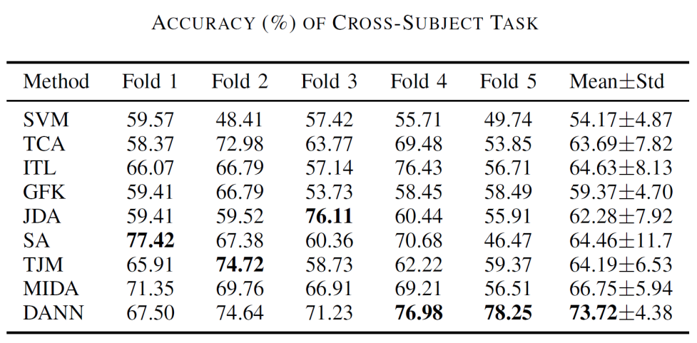
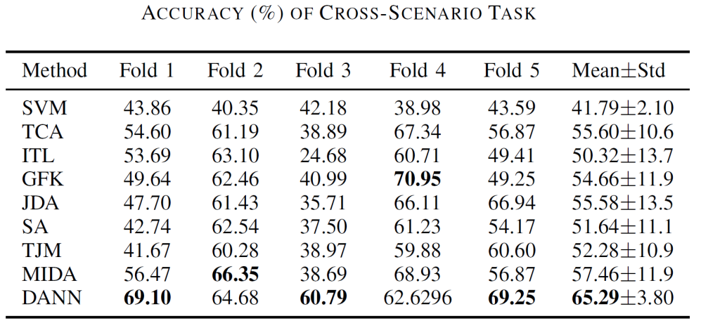
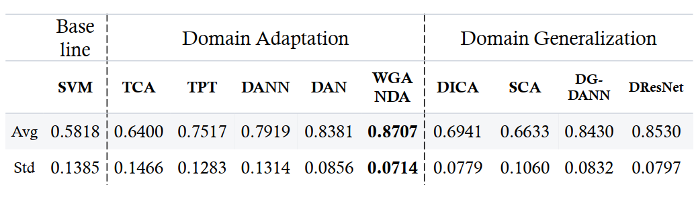
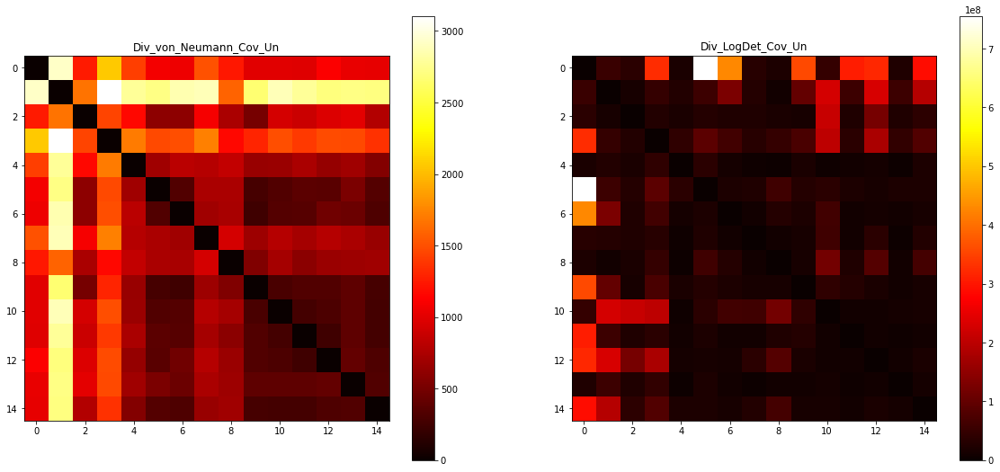
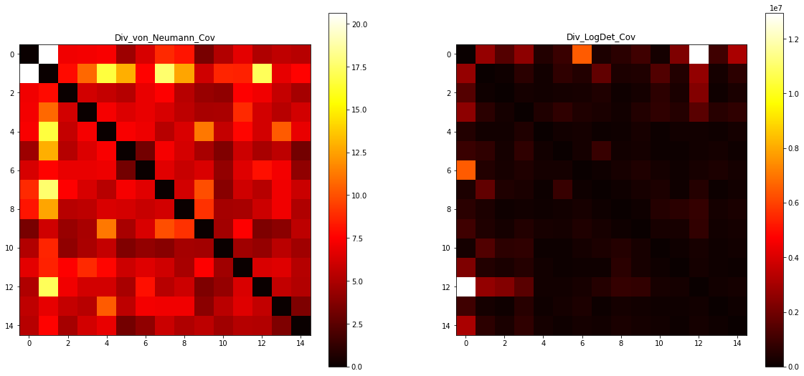
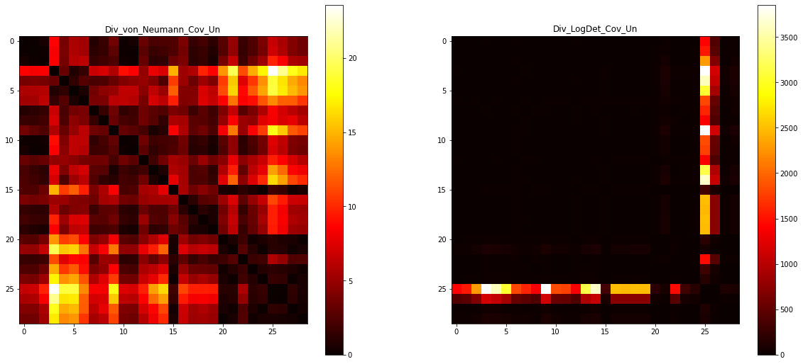
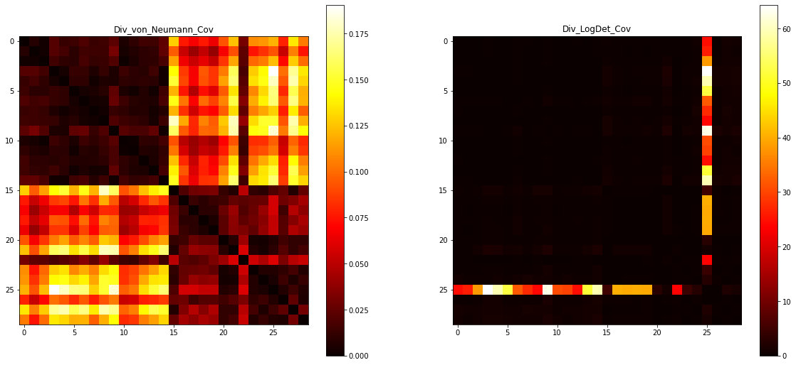
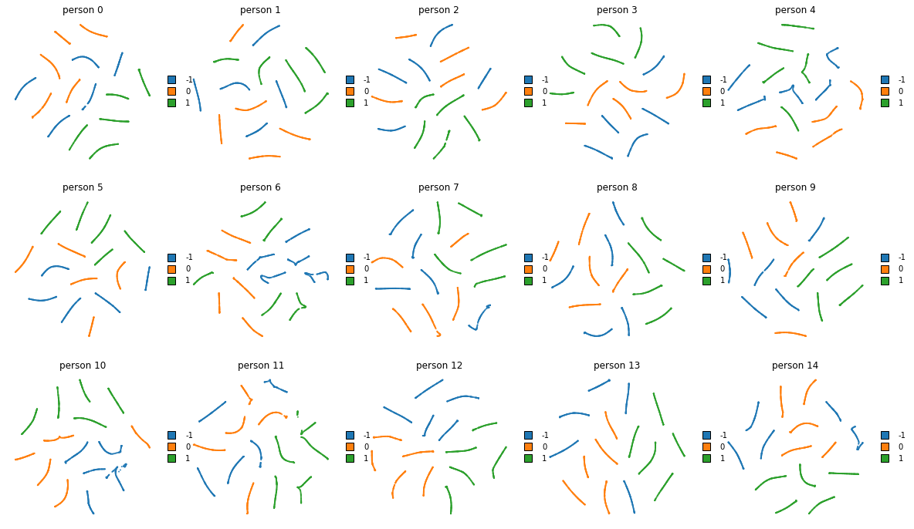

# SEEDLearning
## Description
Repository for our EI314 project.

Aimed at learning from **15** users' **62\*5** EEG features at **3394** time points to predict **3** classes of emotions.

## TODO
- [x] Baseline SVM
- [ ] Survey on Transfer Learning
- [x] Classify the domains among our data
- [x] Test and visualize the 310 features
- [ ] Transform the 310 features if need
- [ ] TPT (Discrepancy-based Domain Adaptation)
- [ ] DANN (Adversarial-based Domain Adaptation)
- [ ] ADDA (Adversarial-based Domain Adaptation)

## Survey
* Some comparisons: 



* Maybe add a baseline on neural network without transfer learning? (Directly train a model on the other 14 and test on the specific one)
* Also we need some methods in Domain Generation

## Domain Classification
* Idea (tl;dr): Want to measure 15 persons' performance difference.
* Idea (detail): From our trivial baseline's bad result, we need to suspect the i.i.d. among the samples from different persons. So we want to measure the 15 persons' sample data's difference, that is, the feature generation distribution $P(X)$ and also the corresponding distribution $P(Y \mid X)$.
* Method: **Bregman Divergence** (more general than **KL divergence**, i.e. Div_LogDet_Cov): `classify_domain.ipynb`
* Result: *each person can be formed as a independent domain*
	* Ours: 
	
	
	* IJCAI20 good: 
	
	

## Features Test and Transformation
* Original features visualization (by **t-SNE**): 


## HowTo
```bash
# install dependencies
pip install -r requirements.txt

# SVM (baseline and kernelized)
bash baseline.sh	# Ubuntu
.\baseline.bat		# Windows

# SA
python SA.py --kernel rbf --C 1e2 --n_dimension 64

# CORAL
python CORAL.py --kernel linear --C 1e-4

# KMM
python KMM.py --kernel linear --C 1e-4

# NNDA (pass argument --help for more information)
python NNDA.py --normalization --num_process 7

# TPT
python TPT.py --normalization

# ADDA
python ADDA.py --normaliation --num_process 7

# DANN (with our improvements)
python DANN.py --normalization --num_process 3

```

## Resources
1. Dataset: <https://cloud.bcmi.sjtu.edu.cn/sharing/fBDlg2VqE>
2. A Survey on Transfer Learning: <https://ieeexplore.ieee.org/abstract/document/5288526>
3. Domain Classify: <https://www.ijcai.org/proceedings/2020/0385.pdf>, <https://github.com/SJYuCNEL/Bregman-Correntropy-Conditional-Divergence>
4. Open t-SNE: <https://opentsne.readthedocs.io/en/latest/index.html>, <https://github.com/pavlin-policar/openTSNE>
5. TPT: <https://dl.acm.org/doi/10.1145/2647868.2654916>
6. DANN: <https://arxiv.org/abs/1409.7495>, <https://github.com/fungtion/DANN_py3>
7. ADDA: <https://arxiv.org/abs/1702.05464>
8. CORAL: <https://ojs.aaai.org/index.php/AAAI/article/view/10306>
9. KMM: <https://proceedings.neurips.cc/paper/2006/hash/a2186aa7c086b46ad4e8bf81e2a3a19b-Abstract.html>
